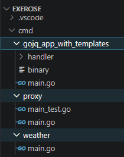

### Summary

    - This code reflects on coding standards(production grade)
    - This code has three different apps rooted from `cmd/`

### Running instructions - `cmd/weather`
    - Install GO 1.21 version locally
    - Invoke `make run` for backend to listen http requests  on port `:3000`
    - Run GET api, as mentioned in API section below

### API for weather service
    - GET `localhost:3000/weather?lat=39.7456&long=-97.0892`

### Added http handler to render templates
    - Set `APP_ENV=prod` in shell env
    
    - `curl --location 'http://localhost:3000/api/v1/user/johndoe?name=john%20doe' --header 'Authorization: Bearer dfssd' --header 'Content-Type: application/json' --data-raw '{
    "age": 1,
    "email": "a@b.com"}'`

    - `curl --location 'http://localhost:3000/api/v2/user/johndoe'`

### Code structure of root folder

